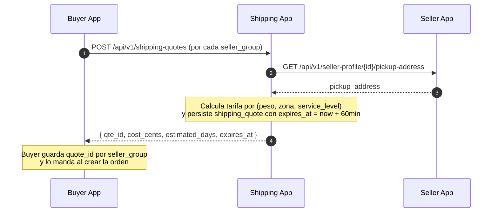
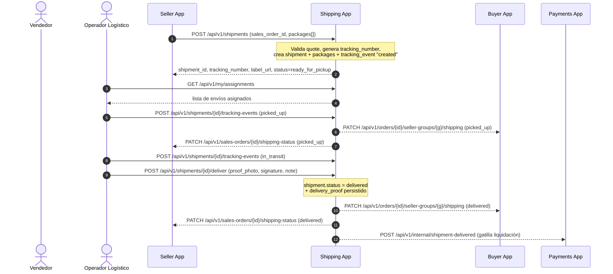
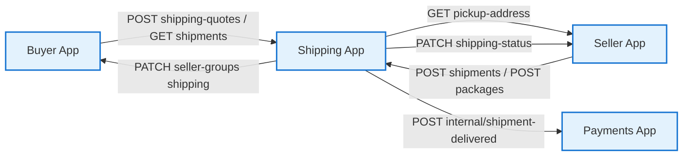

# 1.1 — Descripción del Sistema (Shipping App)

> **Tipo C — Marketplace · BiciMarket · Shipping App**
> Esta copia local del repo de Shipping está recortada para dejar solo lo necesario para implementar y operar Shipping. La versión canónica completa (las 4 apps) vive en `proyecto-c-etapa-1-bicimarket/docs/`.

---

## 1. Qué es BiciMarket

BiciMarket es un marketplace de bicicletas y repuestos que conecta vendedores con compradores. El sistema se compone de **cuatro webapps independientes** (Buyer, Seller, Shipping, Payments) que se comunican entre sí **siempre por REST sobre HTTP**: las consultas con `GET`, las notificaciones de cambio de estado con `POST`/`PATCH` server-to-server, autenticadas con header `X-Service-Token` por par origen↔destino. No hay colas de mensajes, ni event bus, ni firmas HMAC.

### 1.1 Restricción del proyecto: stock ilimitado

> Para esta etapa el sistema **no maneja control de stock**: toda publicación `active` se considera disponible. Para Shipping esto implica que un shipment se crea siempre que la quote sea válida — no hay validación de inventario aguas arriba. Si en una etapa futura se habilita stock, no toca a Shipping.

## 2. Apps del sistema (orientación)

| App | Rol | Responsable |
|---|---|---|
| Buyer App | Carrito y `order` | Camila Rojas |
| Seller App | Catálogo y `sales_orders` | Pierino Spina |
| **Shipping App** | **Logística, dueña de `shipments`, paquetes y eventos de tracking** | **Enrique Seitz (yo)** |
| Payments App | Pasarela MP y liquidaciones | Rocco Paoloni |

> Cada app tiene su propio Clerk. Las apps se hablan solo por REST con `X-Service-Token`. Ver `05-usuarios.md`.

## 3. Actores relevantes para Shipping

| Actor | Apps donde se loguea | Clerk(s) que usa |
|---|---|---|
| Operador logístico | Shipping App | Clerk-Shipping (rol `logistics`) |
| Admin transversal | Shipping App (entre otras) | Clerk-Shipping con `publicMetadata.admin=true` |

## 4. Flujos principales (con foco en Shipping)

Convenciones del diagrama:
- Línea sólida (`->>`): REST iniciado por UI → backend propio.
- Línea punteada (`-->>`): REST server-to-server entre apps (`X-Service-Token`).
- `note`: trabajo interno (DB, validaciones, llamadas externas).

---

### 4.1 Cotización al checkout (Shipping desde la perspectiva del checkout)

Buyer App necesita cotizar envío por cada `seller_group` durante el checkout. Esta es la única vez que Buyer llama a Shipping antes del pago.



> **Sprint 1 / app standalone (ADR-002)**: la llamada saliente a Seller está mockeada (`lib/mocks.ts: getMockPickupAddress`). En sprint 2 se cablea con `callServiceApi`.

---

### 4.2 Despacho y entrega (Shipping protagonista)

Tras el pago, Seller crea el shipment y un operador logístico lo retira y lo entrega.



#### Reglas

- El operador logístico **no ve datos de pago**. Solo dirección, tracking, peso y bultos.
- El `delivery_proof` (foto + nota; firma opcional) es obligatorio para pasar a `delivered`.
- Las notificaciones tras cambio de estado son llamadas REST normales con `X-Service-Token`.

> **Sprint 1 / app standalone (ADR-002)**: las llamadas salientes a Buyer/Seller/Payments están **diferidas**. Se reemplazan por `logger.info({ level: "outbound-deferred", target, payload })`. La lógica de transición local funciona igual.

---

## 5. Mapa de comunicación (foco Shipping)



Toda flecha es REST sobre HTTP con `X-Service-Token`. No hay colas, ni webhooks entre nuestras apps.

## 6. Estado clave: `shipment.status`

```
created → ready_for_pickup → picked_up → in_transit → out_for_delivery → delivered
                                                                       ↘ failed_delivery → in_transit (retry)
                                                                                        ↘ returned (tras N intentos)
```

Diagrama completo + tabla de transiciones permitidas en `06-estados-y-diagramas.md`.