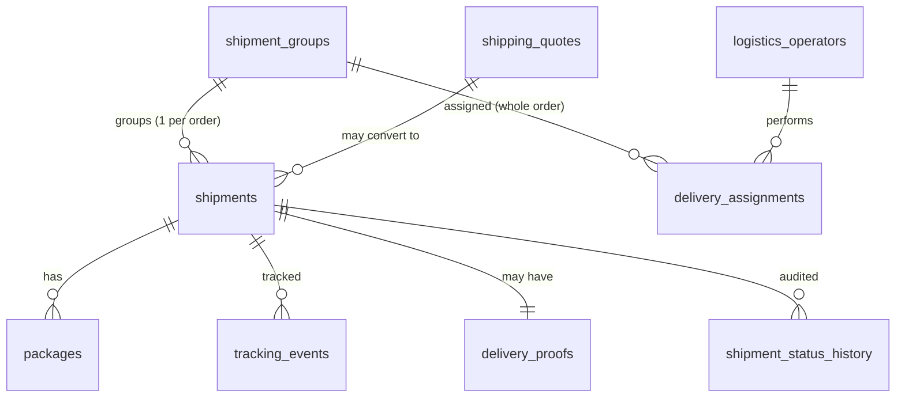

# 1.4 — Modelo de Datos (Shipping App)

> **Tipo C — Marketplace · BiciMarket · Shipping App**
> Copia local recortada. Contiene: reglas comunes de modelado, la DB completa de Shipping App, la máquina de estado de `shipment.status` y la sección de datos duplicados con foco en Shipping. Schemas de Buyer/Seller/Payments en `proyecto-c-etapa-1-bicimarket/docs/`.

---

> **Restricción del proyecto — stock ilimitado**: ninguna DB modela inventario. Ver `01-descripcion.md §1.1`.

## 0. Reglas comunes a todas las DB

- **Motor**: PostgreSQL 16+, una instancia por app.
- **ORM**: Prisma.
- **IDs**: `String @id @default(cuid())` con prefijo de recurso (`shp_`, `qte_`, etc.) generado en aplicación.
- **Timestamps**: `created_at @default(now())` y `updated_at @updatedAt` en toda tabla.
- **Soft deletes**: `deleted_at DateTime?` en entidades con historial relevante (perfiles, operadores).
- **Snapshots**: cuando un campo viene de otra app (precio, dirección, nombre del producto), se guarda con sufijo `_snapshot` y **nunca se actualiza** una vez guardado.
- **Referencias cruzadas**: los IDs de otras apps se guardan como **string opaco**, sin foreign key. La integridad la mantiene el ciclo de vida del negocio.
- **Auditoría**: cualquier cambio de estado relevante (`shipment.status`) deja registro en `shipment_status_history`.
- **Identidad**: cada app tiene su propio Clerk. `clerk_user_id` en cada perfil refiere al Clerk **de esa app**. No existe correlación entre Clerks.

---

## 3. Shipping App — DB `shipping_db`

Fuente de verdad de: `shipment_id`, paquetes, eventos de tracking, operadores logísticos, cotizaciones.

### 3.1 Tablas

#### `logistics_operators`
| Campo | Tipo | Notas |
|---|---|---|
| `id` | string PK | `lop_…` |
| `clerk_user_id` | string unique | Clerk-Shipping |
| `full_name` | string | |
| `phone` | string | |
| `email` | string | |
| `document_id` | string | |
| `vehicle_type` | enum `motorcycle` \| `car` \| `van` \| `truck` | |
| `license_plate` | string | |
| `status` | enum `active` \| `inactive` \| `suspended` | |
| `created_at` / `updated_at` | timestamps | |

#### `shipping_rates` (config)
| Campo | Tipo | Notas |
|---|---|---|
| `id` | string PK | `rat_…` |
| `carrier` | string | `andreani` \| `oca` \| `propio` |
| `service_level` | enum `standard` \| `express` \| `same_day` | |
| `from_postal_prefix` | string | ej. `C14` |
| `to_postal_prefix` | string | |
| `weight_grams_min` | int | |
| `weight_grams_max` | int | |
| `cost_cents` | int | |
| `estimated_days_min` | int | |
| `estimated_days_max` | int | |
| `active` | boolean | |

> **Seed mínimo del sprint 1**: 18 filas = 3 niveles de peso (0–2kg, 2–10kg, 10–50kg) × 2 zonas (CABA-CABA, CABA-GBA) × 3 service_levels.

#### `shipping_quotes`
| Campo | Tipo | Notas |
|---|---|---|
| `id` | string PK | `qte_…` |
| `seller_profile_id` | string | ref opaca |
| `from_address_snapshot` | json | |
| `to_address_snapshot` | json | |
| `service_level` | enum | |
| `carrier` | string | |
| `cost_cents` | int | |
| `weight_grams_total` | int | |
| `packages_snapshot` | json | array de paquetes con peso/dimensiones |
| `idempotency_key` | string? unique | |
| `expires_at` | timestamp | now + 60 min (calculado en aplicación) |
| `created_at` | timestamp | |

#### `shipment_groups` (ADR-006 — el "pedido completo")
Una orden del comprador con N vendedores genera N `shipments` (uno por seller). El `shipment_group` (1 por `order_id`) los agrupa y es **dueño del tracking GLOBAL del pedido** — el único que ve el comprador. Invariante: **siempre existe un grupo**, tenga 1 o N vendedores (el mono-vendedor es un caso particular del general, sin branching).

| Campo | Tipo | Notas |
|---|---|---|
| `id` | string PK | `grp_…` |
| `order_id` | string unique | ref opaca a Buyer; 1 grupo por orden |
| `buyer_profile_id` | string | |
| `tracking_number` | string unique | tracking GLOBAL del pedido (`"BMK-" + random10`). **El único que ve el comprador.** |
| `status` | enum (ver §6) | rollup persistido de los N shipments (`recomputeGroupStatus`, reusa `rollupShipmentStatus`) |
| `service_level` | enum | |
| `shipping_address_snapshot` | json | |
| `origins_count` | int | cantidad de vendedores del pedido |
| `assigned_operator_clerk_user_id` | string? | operador dueño del pedido entero (guard race-safe de auto-asignación). null = disponible |
| `created_at` / `updated_at` | timestamps | |

Índices: `(buyer_profile_id)`, `(status)`. `order_id` y `tracking_number` son unique.

#### `shipments`
| Campo | Tipo | Notas |
|---|---|---|
| `id` | string PK | `shp_…` |
| `order_id` | string | ref opaca a Buyer |
| `order_seller_group_id` | string | ref opaca a Buyer |
| `sales_order_id` | string | ref opaca a Seller |
| `seller_profile_id` | string | |
| `buyer_profile_id` | string | |
| `shipment_group_id` | string FK → shipment_groups | **ADR-006**: pedido al que pertenece. El tracking global vive en el grupo, no se denormaliza acá. onDelete cascade. |
| `shipping_quote_id` | string FK? → shipping_quotes | |
| `carrier` | string | |
| `service_level` | enum | |
| `tracking_number` | string unique | tracking INDIVIDUAL del pickup (`"TRK-AR-" + random8`). **Lo ve solo el vendedor de ese envío.** |
| `label_url` | string | sprint 1: placeholder estático |
| `status` | enum (ver §6) | |
| `weight_grams_total` | int | |
| `cost_cents` | int | |
| `currency` | string | |
| `shipping_address_snapshot` | json | |
| `pickup_address_snapshot` | json | |
| `idempotency_key` | string? unique | |
| `shipped_at` / `delivered_at` | timestamps? | |
| `created_at` / `updated_at` | timestamps | |

Índices: `(order_id)`, `(order_seller_group_id)`, `(sales_order_id)`, `(seller_profile_id)`, `(buyer_profile_id)`, `(shipment_group_id)`, `(tracking_number)`, `(status)`, `(created_at)`.

#### `packages`
| Campo | Tipo | Notas |
|---|---|---|
| `id` | string PK | `pkg_…` |
| `shipment_id` | string FK | |
| `weight_grams` | int | |
| `length_cm`, `width_cm`, `height_cm` | int | |
| `description` | string? | |
| `label_url` | string? | etiqueta individual del paquete |

#### `tracking_events`
| Campo | Tipo | Notas |
|---|---|---|
| `id` | string PK | `evt_…` |
| `shipment_id` | string FK | |
| `event_type` | enum (ver §6) | |
| `location` | string? | |
| `note` | string? | |
| `occurred_at` | timestamp | |
| `created_at` | timestamp | |

#### `delivery_assignments`
**ADR-006**: la asignación es a nivel **pedido** (grupo) — un operador toma el pedido entero y maneja todos los pickups de todos los vendedores. La FK real es `shipment_group_id`; `shipment_id` queda nullable/legacy.

| Campo | Tipo | Notas |
|---|---|---|
| `id` | string PK | `dla_…` |
| `shipment_group_id` | string? FK → shipment_groups | nivel real de asignación (el pedido completo) |
| `shipment_id` | string? FK | nullable/legacy (asignaciones históricas por-envío) |
| `operator_clerk_user_id` | string | |
| `status` | enum `assigned` \| `accepted` \| `picked_up` \| `delivered` \| `reassigned` \| `cancelled` | |
| `assigned_at` | timestamp | |
| `completed_at` | timestamp? | |

#### `delivery_proofs`
| Campo | Tipo | Notas |
|---|---|---|
| `id` | string PK | `prf_…` |
| `shipment_id` | string FK | |
| `proof_photo_url` | string | URL o `data:image/...;base64,…` (sprint 1: base64 inline) |
| `signature_image_url` | string? | opcional |
| `note` | string? | |
| `delivered_at` | timestamp | |

#### `shipment_status_history` (auditoría)
| Campo | Tipo | Notas |
|---|---|---|
| `id` | string PK | `ssh_…` |
| `shipment_id` | string FK | |
| `from_status` | string | |
| `to_status` | string | |
| `source` | string | `logistics` \| `admin` \| `system` |
| `payload` | json? | |
| `occurred_at` | timestamp | |

### 3.2 Diagrama



> **ADR-006**: `tracking_number` del comprador = `shipment_groups.tracking_number` (`BMK-…`, global). `tracking_number` del vendedor = `shipments.tracking_number` (`TRK-AR-…`, individual). El operador y el comprador ven el pedido completo (todos los vendedores); cada vendedor ve solo su envío.

---

## 6. Máquina de estado: `shipment.status`

```
created ─► ready_for_pickup ─► picked_up ─► in_transit ─► out_for_delivery ─► delivered
                                                                          └─► failed_delivery ─► returned
```

Diagrama + tabla completa de transiciones permitidas en `06-estados-y-diagramas.md`.

---

## 7. Datos duplicados y estrategia de consistencia (foco Shipping)

| Dato | Apps que lo tienen | Fuente de verdad | Estrategia en Shipping |
|---|---|---|---|
| Identidad de usuario | Cada app tiene su Clerk | El Clerk de cada app | Sin sync entre Clerks. Operador logístico = cuenta en Clerk-Shipping. |
| `shipment_id` y estado de envío | **Shipping (verdad)**, Buyer, Seller | **Shipping App** | Shipping notifica con `PATCH` REST a Buyer y Seller; ellos guardan `shipping_status` espejo. **ADR-006**: a Buyer se le manda el tracking GLOBAL del pedido (`BMK-…`); a Seller, el `shipment_id` de su envío. |
| Tracking del pedido (global) vs del envío (individual) | **Shipping (verdad)** | **Shipping App** | `shipment_groups.tracking_number` (`BMK-…`) lo ve el comprador; `shipments.tracking_number` (`TRK-AR-…`) lo ve cada vendedor para su propio envío. |
| `order_id` y estado de la orden | Buyer (verdad), Shipping | **Buyer App** | Shipping guarda `order_id` como string opaco. Nunca consulta a Buyer en runtime (solo notifica). |
| `sales_order_id` | Seller (verdad), Shipping | **Seller App** | Ref opaca; nunca se consulta. |
| `seller_profile_id` + pickup_address | Seller (verdad), Shipping (snapshot) | **Seller App** | Shipping hidrata `pickup_address` una vez (al crear quote/shipment) y la guarda como snapshot. Nunca se actualiza. |
| Dirección de envío del comprador | Buyer (verdad), Shipping (snapshot) | **Buyer App** | Snapshot recibido en `POST /shipments`; nunca se actualiza. |
| Comisión y net del settlement | Payments (verdad) | **Payments App** | Shipping no la conoce. Solo dispara el `POST /internal/shipment-delivered`. |