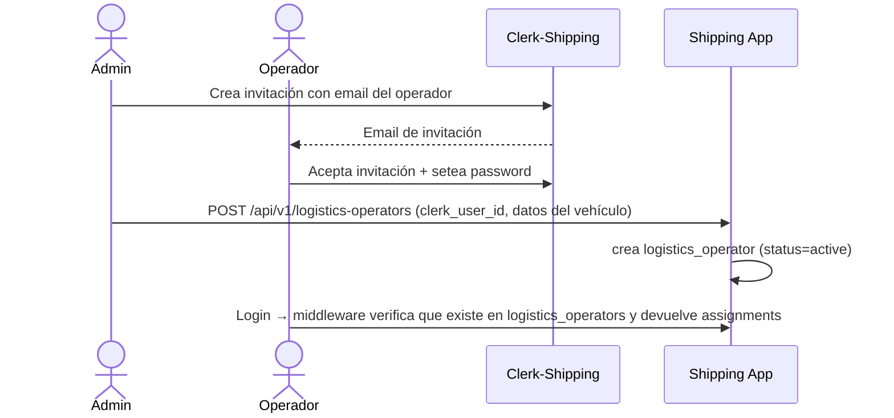

# 1.5 — Usuarios (Shipping App)

> **Tipo C — Marketplace · BiciMarket · Shipping App**
> Copia local recortada. Mapa de Clerks de orientación, foco en Clerk-Shipping, claims, provisioning perezoso y flujo de alta del operador logístico. Detalles de los Clerks de las otras 3 apps en `proyecto-c-etapa-1-bicimarket/docs/`.

---

## 1. Mapa de Clerks (orientación)

| App | Clerk app name | Rol funcional | Audiencia del JWT |
|---|---|---|---|
| Buyer App | `buyer.bicimarket` | `buyer` | `bicimarket-buyer-api` |
| Seller App | `seller.bicimarket` | `seller` | `bicimarket-seller-api` |
| **Shipping App** | **`shipping.bicimarket`** | **`logistics`** | **`bicimarket-shipping-api`** |
| Payments App | `payments.bicimarket` | `admin` (obligatorio) | `bicimarket-payments-api` |

> Cada Clerk emite JWT con un `aud` propio. Shipping valida solo tokens de Clerk-Shipping. Si llega un JWT firmado por otro Clerk, se rechaza.

> **Sin identidad cruzada entre Clerks.** Si una misma persona es buyer + operador logístico, son cuentas separadas. Shipping no las correlaciona.

---

## 2. Rol `admin` transversal

Hay un rol transversal: `admin`. En Clerk-Shipping se marca con `publicMetadata.admin = true` para el reducido grupo de admins.

Promoción a admin: la hace un admin existente vía Clerk Dashboard. Sin self-service.

Operaciones admin en Shipping (alta de operadores, reasignaciones, cambio manual de status) requieren `publicMetadata.admin === true` en el JWT.

---

## 3. Sincronización Clerk → DB local (provisioning perezoso, sin webhooks)

> **Decisión del proyecto**: no usamos webhooks de Clerk. Cada app sincroniza su perfil local **al momento del login**, leyendo el JWT validado y haciendo upsert en su DB. Trade-off conocido: los cambios hechos en Clerk Dashboard solo se reflejan cuando el usuario vuelve a loguearse, pero a cambio nos ahorramos un endpoint público con firma y todo el manejo de retry.

### 3.1 Cómo funciona en Shipping

En el middleware de auth de Shipping, antes de pasarle el request al controller:

1. Validar el JWT de Clerk → obtener `clerk_user_id`, `email`, `full_name`.
2. Buscar el `logistics_operator` por `clerk_user_id`.
3. Si no existe → **devolver 403** (los operadores no se autoaprovisionan; los crea un admin con `POST /api/v1/logistics-operators`).
4. Si existe pero `email` o `full_name` cambiaron respecto del JWT → actualizar el snapshot.
5. Continuar con el request normal.

Esto se hace en cada request, pero el costo es despreciable porque solo es un `SELECT` por `clerk_user_id` (índice único). Solo escribe cuando hay cambios reales.

### 3.2 Comportamiento al primer login en Shipping

| Caso | Acción |
|---|---|
| `clerk_user_id` figura en `logistics_operators` con `status=active` | Entra normal, devuelve sus assignments. |
| `clerk_user_id` figura pero `status=inactive` o `suspended` | 403 `OPERATOR_INACTIVE`. |
| `clerk_user_id` NO figura | 403 `FORBIDDEN`. Tiene que ser invitado/creado por admin. |
| JWT con `publicMetadata.admin=true` | Acceso a endpoints admin. Si no tiene `logistics_operator`, igual puede operar como admin. |

### 3.3 Soft delete

Cuando se borra una cuenta en Clerk, no nos enteramos. Si hace falta, el admin marca `logistics_operator.status=inactive` manualmente. Para Etapa 1 basta con la limpieza manual.

---

## 4. Claims del JWT requeridos en Shipping

| Claim | Validación |
|---|---|
| `sub` (clerk_user_id) | usado para buscar `logistics_operator` |
| `email` | snapshot |
| `email_verified` | debe ser `true` |
| `iss` | `https://clerk.shipping.bicimarket.com` |
| `aud` | `bicimarket-shipping-api` |
| `publicMetadata.admin` (opcional) | si está `true`, habilita endpoints admin |

---

## 5. Reglas de roles en Shipping

1. **El rol funcional es implícito por el Clerk**. Si entrás con JWT de Clerk-Shipping y existe tu `logistics_operator`, sos operador.
2. **`admin` es transversal** y vive en `publicMetadata.admin`. En Clerk-Shipping es opcional.
3. **El alta de operador logístico no es libre**: requiere invitación de un admin (no hay sign-up público para `logistics`).

### 5.1 Flujo de alta del operador logístico



> **Sprint 1**: para el parcial el `clerk_user_id` del operador se obtiene manualmente del Clerk Dashboard y se carga vía `POST /api/v1/logistics-operators`. No hay UI de invitación todavía.

---

## 6. Variables de entorno (Clerk-Shipping)

```env
# Clerk de Shipping
CLERK_PUBLISHABLE_KEY=pk_live_…
CLERK_SECRET_KEY=sk_live_…
CLERK_ISSUER=https://clerk.shipping.bicimarket.com
CLERK_AUDIENCE=bicimarket-shipping-api
```

No se comparten entre apps. Si Shipping necesitara el `CLERK_SECRET_KEY` de otra app, está mal — no debe.