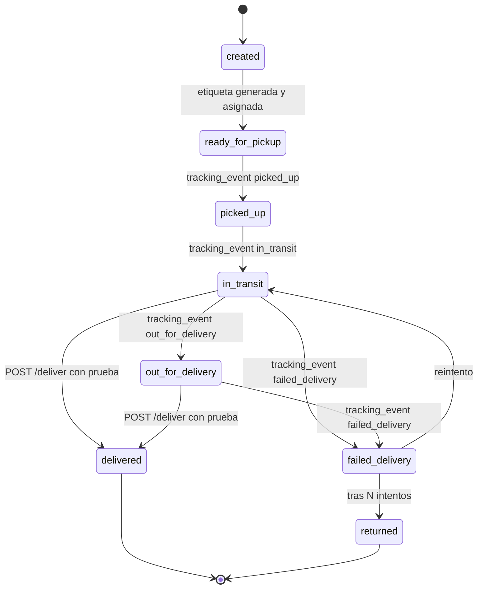
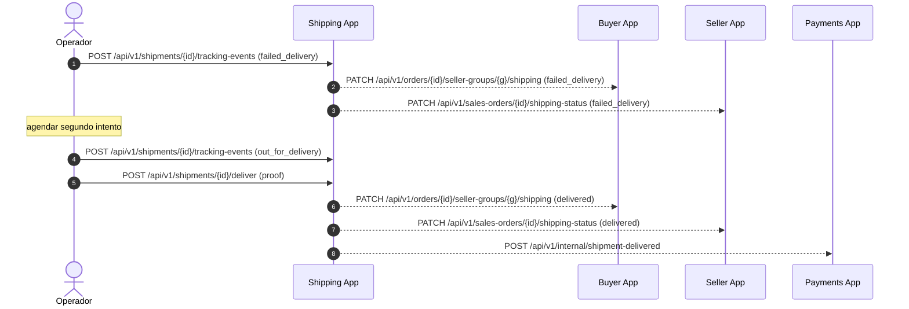

# 1.6 — Estados y Diagramas (Shipping App)

> **Tipo C — Marketplace · BiciMarket · Shipping App**
> Copia local recortada: solo máquina de estado de `shipment.status`, diagrama de carril de entrega fallida y tabla normativa de transiciones permitidas para shipments. Las máquinas de estado de las otras 3 apps quedan en `proyecto-c-etapa-1-bicimarket/docs/`.

> **Restricción del proyecto — stock ilimitado**: ningún diagrama contempla descuento/reserva de stock. Ver `01-descripcion.md §1.1`.

---

## 1. Máquina de estado: `shipment.status`



**Reglas**:
- Una transición inválida debe rechazarse con HTTP `409 INVALID_TRANSITION` y `details: { from, to, allowed: [...] }`.
- `delivered` y `returned` son terminales.
- El cambio de estado lo dispara `POST /tracking-events` o `POST /deliver`; ambos validan la transición con `assertTransition()` (ver `lib/transitions.ts`, ticket T03).

---

## 2. Diagrama de carril — entrega fallida y reintento



Al acumular 3 eventos `failed_delivery`, el mismo request registra primero el
fallo y luego aplica automáticamente `failed_delivery → returned`. Se crean
ambos registros de historial y el estado final `returned` se notifica a
Buyer/Seller. El reembolso posterior es responsabilidad de Payments.

> **Sprint 1 (ADR-002)**: las flechas salientes `SH-->>` están diferidas — se reemplazan por logs `outbound-deferred`. La lógica de transición local funciona igual.

---

## 3. Transiciones permitidas: `shipment.status` (tabla normativa)

Toda transición inválida debe rechazarse con `409 INVALID_TRANSITION`. Esta tabla es la fuente de verdad para `lib/transitions.ts` (ver ticket T03):

| from \ to | ready_for_pickup | picked_up | in_transit | out_for_delivery | delivered | failed_delivery | returned |
|---|---|---|---|---|---|---|---|
| created | ✅ | ❌ | ❌ | ❌ | ❌ | ❌ | ❌ |
| ready_for_pickup | ❌ | ✅ | ❌ | ❌ | ❌ | ❌ | ❌ |
| picked_up | ❌ | ❌ | ✅ | ❌ | ❌ | ❌ | ❌ |
| in_transit | ❌ | ❌ | ❌ | ✅ | ✅ | ✅ | ❌ |
| out_for_delivery | ❌ | ❌ | ❌ | ❌ | ✅ | ✅ | ❌ |
| failed_delivery | ❌ | ❌ | ✅ | ❌ | ❌ | ❌ | ✅ |
| delivered | ❌ | ❌ | ❌ | ❌ | ❌ | ❌ | ❌ |
| returned | ❌ | ❌ | ❌ | ❌ | ❌ | ❌ | ❌ |

---

## 4. Estado agregado del pedido (ADR-006 — entidad persistida)

Una orden con N vendedores genera N `Shipment` agrupados por un **`shipment_group`** (1 por `order_id`). La máquina de estado de arriba sigue siendo **por shipment** — cada pickup transiciona independiente. El estado del pedido se **persiste** en `shipment_group.status` como rollup de los N shipments, recomputado dentro de la misma transacción que cambia cualquier shipment (`recomputeGroupStatus`, reusa `rollupShipmentStatus`):

1. Todos `delivered` → grupo `delivered`.
2. Alguno `failed_delivery` → grupo `failed_delivery` (prioridad de atención).
3. Alguno `returned` → grupo `returned`.
4. Si no, el estado **menos avanzado** (el bottleneck del pedido).

> **Entrega parcial (estado derivado de UI, no de la DB)**: cuando el grupo tiene al menos un envío `delivered` Y al menos otro `failed_delivery`/`returned`, el rollup persiste `failed_delivery`/`returned` por prioridad, pero la UI muestra un badge **"Entrega parcial"** (`isPartialDelivery` + `OrderStatusBadge`) para no "tapar" los envíos que sí llegaron. No se agrega ningún estado nuevo al enum ni a la máquina. La liquidación al vendedor es **por envío** (se gatilla cuando ese envío se entrega), así que un envío entregado dentro de un grupo parcial igual liquida.

Además, cuando se marca el último pickup de un pedido como `picked_up` y todos los demás del mismo grupo ya están en `picked_up` o más adelante, el handler de tracking-events emite un log derivado (CR2, "todos retirados"):

```
{ level: "outbound-deferred", target: "buyer", method: "POST",
  path: "/api/v1/orders/{order_id}/all-shipments-picked-up",
  payload: { order_id, shipment_ids: [shp_..., shp_...], occurred_at } }
```

Aplica solo cuando el grupo tiene >1 shipment (multi-vendedor). Para single-origen alcanza con los CR2/CR3 individuales.

> **Sprint 1 (ADR-002)**: este log queda como `outbound-deferred`. En sprint 2 se convierte en una llamada real al Buyer.

> **UI del flujo (ADR-006)**: `OrderShipmentFlow` dibuja **un carril por envío** (no una línea consolidada): cada carril se colorea con el estado individual de SU shipment, así la divergencia (uno entregado, otro no) se ve honestamente y el pedido no figura "completo" hasta que todos los carriles lleguen a `delivered`. La **vista ENVÍO (TRK)** del `/track` es el caso particular de **1 carril**, y el **Historial** del `/track` muestra **un timeline por envío** (`order_timelines[]`; TRK = 1). En el detalle del operador, cada envío se **avanza desde su fila** (`OriginPickupRow`: retiro → tránsito → reparto → entrega, + reintento en `failed_delivery`); el botón bulk es un atajo que opera solo sobre los envíos **activos**, de modo que un envío fallido/entregado no bloquea avanzar el resto.
