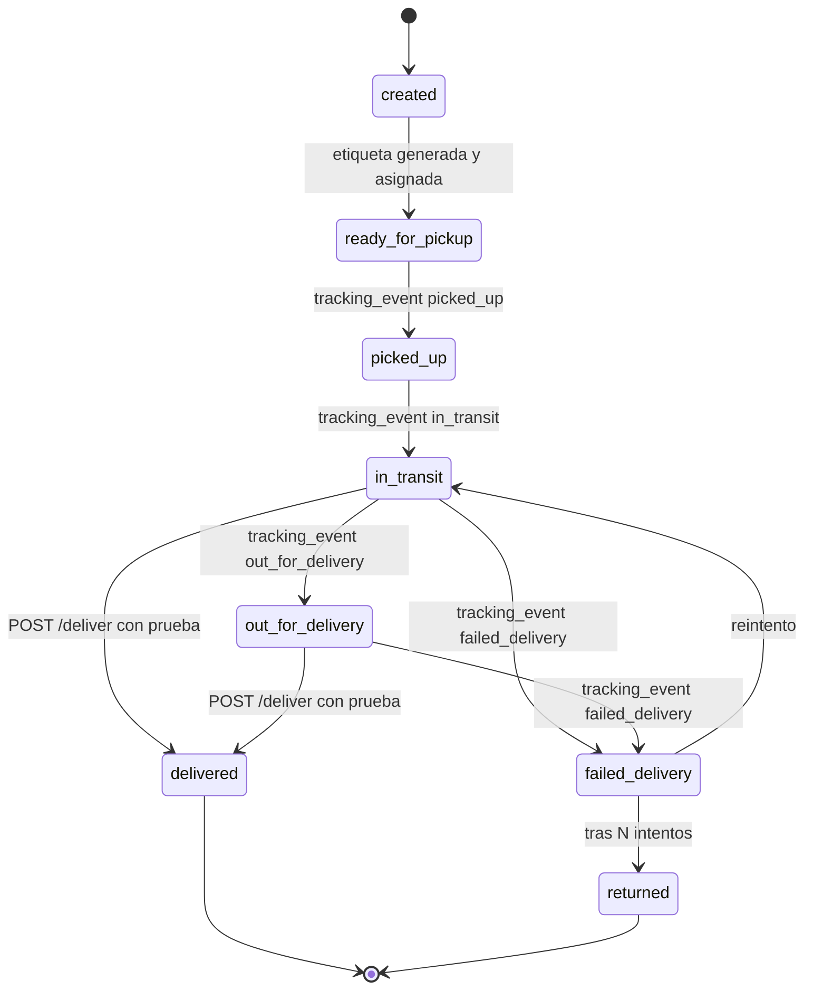
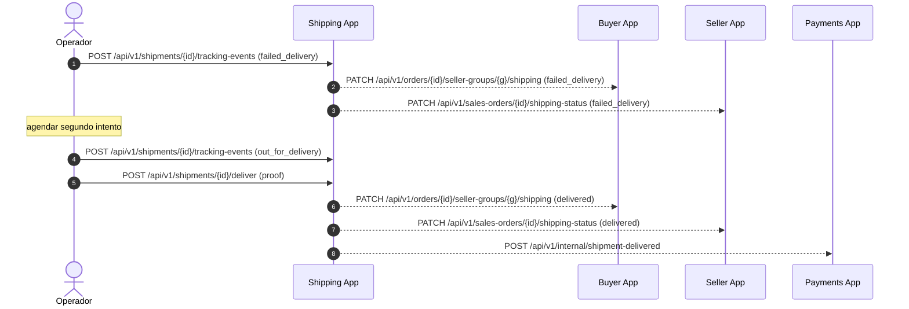

# 1.6 — Estados y Diagramas (Shipping App)

> **Tipo C — Marketplace · BiciMarket · Shipping App**
> Copia local recortada: solo máquina de estado de `shipment.status`, diagrama de carril de entrega fallida y tabla normativa de transiciones permitidas para shipments. Las máquinas de estado de las otras 3 apps quedan en `proyecto-c-etapa-1-bicimarket/docs/`.

> **Restricción del proyecto — stock ilimitado**: ningún diagrama contempla descuento/reserva de stock. Ver `01-descripcion.md §1.1`.

---

## 1. Máquina de estado: `shipment.status`

**Reglas**:
- Una transición inválida debe rechazarse con HTTP `409 INVALID_TRANSITION` y `details: { from, to, allowed: [...] }`.
- `delivered` y `returned` son terminales.
- El cambio de estado lo dispara `POST /tracking-events` o `POST /deliver`; ambos validan la transición con `assertTransition()` (ver `lib/transitions.ts`, ticket T03).

---

## 2. Diagrama de carril — entrega fallida y reintento

Si el segundo intento también falla y se acumulan 3 intentos, el shipment pasa a `returned` y se dispara el flujo de reembolso (gestionado por Payments — fuera del scope de Shipping).

> **Sprint 1 (ADR-002)**: las flechas salientes `SH-->>` están diferidas — se reemplazan por logs `outbound-deferred`. La lógica de transición local funciona igual.

---

## 3. Transiciones permitidas: `shipment.status` (tabla normativa)

Toda transición inválida debe rechazarse con `409 INVALID_TRANSITION`. Esta tabla es la fuente de verdad para `lib/transitions.ts` (ver ticket T03):

| from \ to | ready_for_pickup | picked_up | in_transit | out_for_delivery | delivered | failed_delivery | returned |
|---|---|---|---|---|---|---|---|
| created | ✅ | ❌ | ❌ | ❌ | ❌ | ❌ | ❌ |
| ready_for_pickup | ❌ | ✅ | ❌ | ❌ | ❌ | ❌ | ❌ |
| picked_up | ❌ | ❌ | ✅ | ❌ | ❌ | ❌ | ❌ |
| in_transit | ❌ | ❌ | ❌ | ✅ | ✅ | ✅ | ❌ |
| out_for_delivery | ❌ | ❌ | ❌ | ❌ | ✅ | ✅ | ❌ |
| failed_delivery | ❌ | ❌ | ✅ | ❌ | ❌ | ❌ | ✅ |
| delivered | ❌ | ❌ | ❌ | ❌ | ❌ | ❌ | ❌ |
| returned | ❌ | ❌ | ❌ | ❌ | ❌ | ❌ | ❌ |